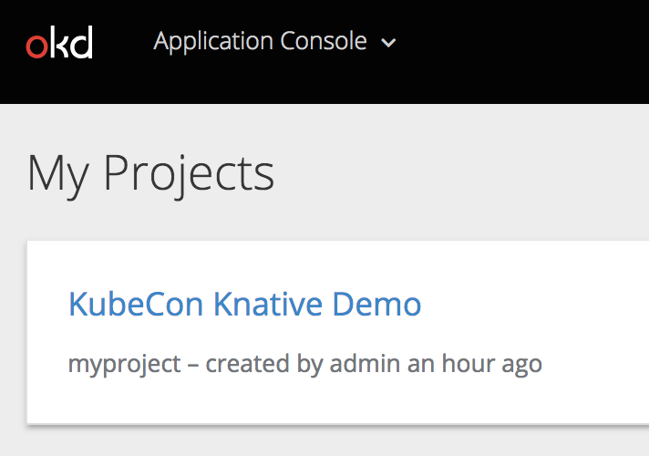

In the Terminal window to the right, OpenShift is starting up and then the install script is installing the Knative
components onto this OpenShift cluster.

This will take a few minutes to complete.  Once the OpenShift Startup and Configuring completes, we can open the 
OpenShift Web Console while the Knative install is proceeding.  

To do this click on the "OpenShift Console" tab next to the "Terminal" tab.  This will open the OpenShift Web Console in a
new browser tab/window.

The first screen you will see is the authentication screen. Enter your username and password to login. For this demo,
please use `admin/admin`.

After you have authenticated to the web console, you will either be presented with the default Service Catalog view or
the Application Console view.  If you are in the Service Catalog view, in the upper
left corner there is a pull-down next to "Service Catalog" where you can choose the "Application Console" view.

Once you are in the Application Console view, click on the Create Project button and specify name "myproject" for the 
Name and "KubeCon Knative Demo" as the Display Name.

After you press the "Create" button, it will show your project in the My Projects view.  Click on your newly created project
to get to the cosole for your project.

Now, go back to the Terminal tab and set the CLI to point to the newly created project with this command:

``oc project myproject``{{execute}}

And allow access to the new project with these 2 commands:

``oc adm policy add-scc-to-user anyuid -z default -n myproject``{{execute}

``oc adm policy add-scc-to-user privileged -z default -n myproject``{{execute}

Now, you are ready to move on to the next step in the demo.
